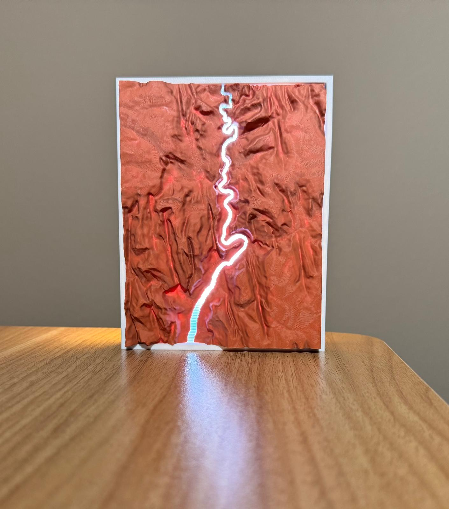
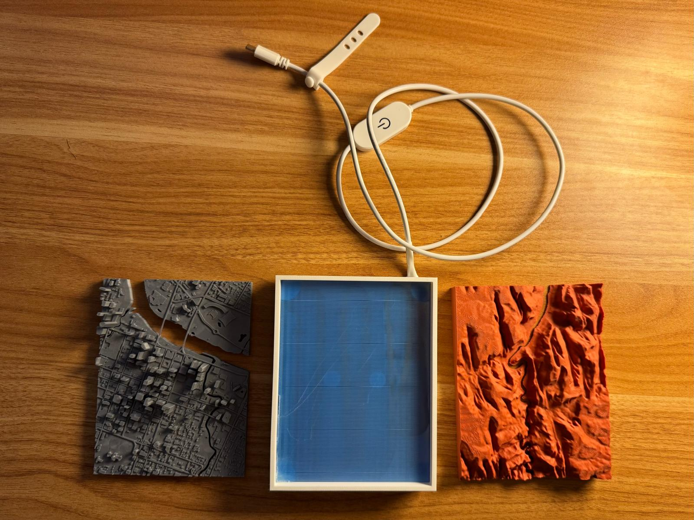

# ModularTerrainLamp
A modular magnetic lamp system with interchangeable 3D-printed terrain faceplates (Zion Canyon, Austin, and more)

## Features 
- Magnetic faceplates for easy swapping
- Backlit with warm diffused LEDs
- Designed using Fusion360 and Blender
- USB-C power input

## Future Ideas
- Add Matter/ESP32 smart control
- RGBW LED support
- More geographic faceplates (Grand Canyon, major city, etc.)

## Gallery

  
  

